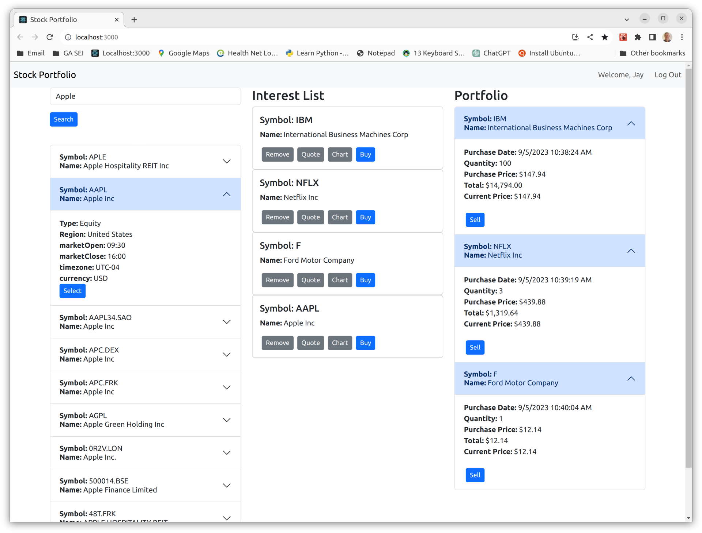
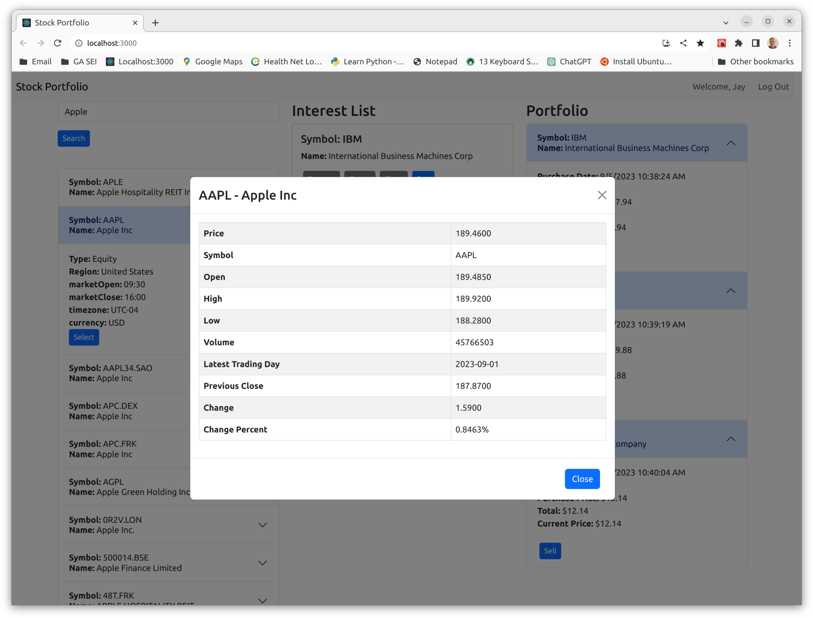
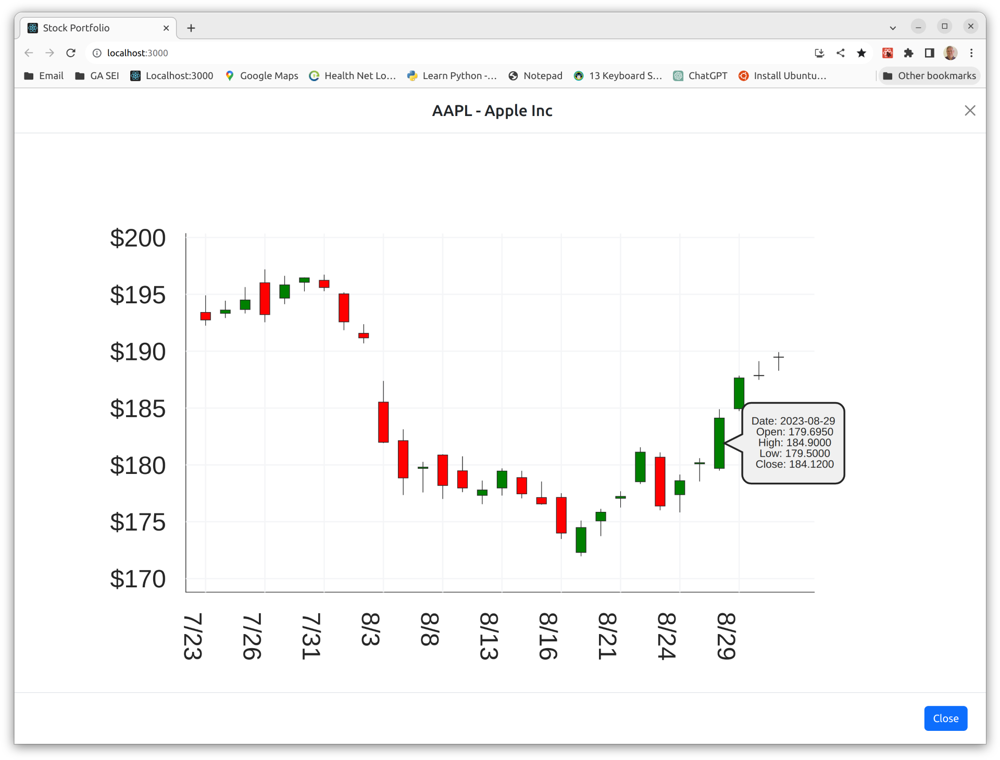

# Stock Portfolio (GA SEI Project 4)

The Stock Portfolio application allows the user to track their stock potfolio's performance. It 
uses the Alpha Vantage API to obtain near-real-time stock price information as well as 
historical stock performance going back 20+ years.  A user can search for stocks based on name or 
stock ticker symbol, add stocks to their interst list, and buy stocks.  After buying a stock, a 
user can check how much the stock has gone up or down, and then ultimately sell it.

## Screenshots
#### Main Page

#### Stock Quote

#### Stock Chart

## Technologies Used
* MERN Stack
    * MongoDB/Mongoose
    * Express
    * React
    * Node
* React-Bootstrap
* Alpha Vantage API for stock information
* Victory data visualizations for React

## Getting Started

##### Deployed app (Heroku)
https://stock-portfolio-d2c8bfa2b3c5.herokuapp.com/

##### Trello Board:
https://trello.com/b/vDOWYeIB/stock-portfolio-project-4

## Next Steps
Planned future enhancements (icebox items).
* Add ability to choose different time spans for the Stock Chart
    * Week
    * Month
    * Year
    * Lifetime
* Add chart of stock performance from time of purchase to sale.
* Handle foreign currencies properly
